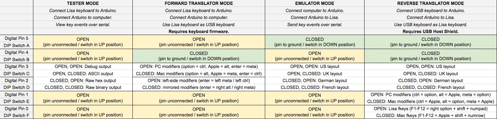

# LisaKeys
Apple Lisa Keyboard Tester/Translator/Emulator

This Arduino sketch can function in four different modes:

* Tester Mode: Capture keystrokes from a Lisa keyboard and print them over serial.
* Forward Translator Mode: Use a Lisa keyboard as a USB keyboard on a modern device.
* Emulator Mode: Read instructions over serial and send keystrokes to a Lisa.
* Reverse Translator Mode: Use a modern USB keyboard as a keyboard on a Lisa.

To compile the sketch you must add the USB Host Shield library to the Arduino IDE, found [here](https://github.com/felis/USB_Host_Shield_2.0). Or, if you do not plan to use Reverse Translator Mode, you can comment out the line `#define USBK_USE_HOST_SHIELD` in `usbkeysconfig.h`.

There are also gerber files for a shield to make connections and configuration easier. You can [buy a PCB from Aisler](https://aisler.net/p/EULWZNWF).

## Connections

### Lisa Keyboard Connections
* Lisa keyboard VCC, tip of TRS connector: connect to Arduino +5V.
* Lisa keyboard DATA, ring of TRS connector: connect to Arduino digital pin 6.
* Lisa keyboard GND, sleeve of TRS connector: connect to Arduino GND.

### Arduino Connections
* Digital pins 0-5: used to select settings.
* Digital pin 6: connect to Lisa keyboard DATA line.
* Digital pins 7-13: reserved for USB Host Shield.
* Analog pins 0-5: used for a keypad.

### "DIP Switch" Settings
Digital pins 0-5 are used to select the mode of operation and settings for that mode. These are present on the shield as switches or jumpers labeled A-F. To leave the "DIP switch" in the OPEN position, leave the pin disconnected or set the switch to the UP position. To leave the "DIP switch" in the CLOSED position, connect the pin to GND or set the switch to the DOWN position.

* Digital pin 5 / switch A:
  * OPEN: `LK>` - Lisa Keyboard In. Tester / Forward Translator Mode. Connect Lisa keyboard to Arduino and Arduino to modern device.
  * CLOSED: `>LH` - To Lisa Host. Emulator / Reverse Translator Mode. Connect modern device to Arduino and Arduino to Lisa.
* Digital pin 4 / switch B:
  * OPEN: `SER` - Serial. Tester / Emulator Mode. Arduino communicates with a modern device over serial.
  * CLOSED: `USB`. Translator Mode. Arduino acts as a USB keyboard device or host, depending on switch A.
* Digital pin 3 / switch C:
  * In Tester Mode:
    * OPEN: Key events are output as debug statements or ASCII characters.
    * CLOSED: Key events are output as raw hex dump or raw binary.
  * In Forward Translator Mode:
    * OPEN: `PC` - PC Modifiers. Left Option = Ctrl, Apple = Alt, Enter = Meta (or Right Alt).
    * CLOSED: `MAC` - Mac Modifiers. Left Option = Alt, Apple = Meta, Enter = Ctrl (or Right Meta).
  * In Emulator or Reverse Translator Mode:
    * OPEN: `US/UK`. Selects US or UK keyboard ID.
    * CLOSED: `DE/FR`. Selects German or French keyboard ID.
* Digital pin 2 / switch D:
  * In Tester Mode:
    * OPEN: Key events are output as debug statements or raw hex dump.
    * CLOSED: Key events are output as ASCII characters or raw binary.
  * In Forward Translator Mode:
    * OPEN: `LFT` - Left Modifiers. Enter = Meta or Ctrl.
    * CLOSED: `MIR` - Mirrored Modifiers. Enter = Right Alt or Right Meta.
  * In Emulator or Reverse Translator Mode:
    * OPEN: `US/DE`. Selects US or German keyboard ID.
    * CLOSED: `UK/FR`. Selects UK or French keyboard ID.
* Digital pin 1 / switch E:
  * In Reverse Translator Mode:
    * OPEN: `PC` - PC Modifiers. Ctrl/Meta = Option, Alt = Apple, Right Alt = Enter.
    * CLOSED: `MAC` - Mac Modifiers. Alt = Option, Ctrl/Meta = Apple, Right Ctrl/Meta = Enter.
  * In all other modes, must be OPEN.
* Digital pin 0 / switch F:
  * In Reverse Translator Mode:
    * OPEN: `LFK` - Lisa FKeys. F1-F12 = Right Option + Shift + numeric keypad.
    * CLOSED: `MFK` - Mac FKeys. F1-F12 = Apple + Shift + number row.
  * In all other modes, must be OPEN.

### Keypad Connections
Analog pins 0-5 can be used to provide a 3x3 keypad for pressing certain keys on a Lisa keyboard without requiring a full keyboard. This keypad is present on the shield. A0, A1, and A2 are the anodes or "sense" lines, and A3, A4, and A5 are the cathodes or "pulse" lines.

* Analog pin 0: Top row - 1, 2, 3
* Analog pin 1: Middle row - S, ., Return
* Analog pin 2: Bottom row - Shift, Apple, Space
* Analog pin 3: Left column - 1, S, Shift
* Analog pin 4: Center column - 2, ., Apple
* Analog pin 5: Right column - 3, Return, Space

If you don't want to build a full keyboard matrix, you can connect diodes between the pins when you want to activate the keys. The anode must be connected to one of A0, A1, or A2 and the cathode must be connected to one of A3, A4, or A5.
* A0 to A3: 1
* A0 to A4: 2
* A0 to A5: 3
* A1 to A3: S
* A1 to A4: .
* A1 to A5: Return
* A2 to A3: Shift
* A2 to A4: Apple
* A2 to A5: Space

## Tester Mode
Connect a Lisa keyboard to the Arduino. Connect the Arduino to a modern device over USB. Connect to the Arduino from the modern device over USB serial at 9600 baud (using the Arduino Serial Monitor, for example). Key events coming from the Lisa keyboard will be printed over serial.

With digital pins 3, 2 / switches C, D both OPEN, key events will be printed as messages, as in the following example output.

    READY
    INITED BF US
    PRESSED 68 ~
    RELEASED 68 ~
    PRESSED 45 Backspace
    RELEASED 45 Backspace
    PRESSED 7F Apple
    PRESSED 76 S
    RELEASED 76 S
    RELEASED 7F Apple
    PRESSED 7C L Option
    PRESSED 70 A
    RELEASED 70 A
    RELEASED 7C L Option

With digital pin 3 / switch C OPEN and digital pin 2 / switch D CLOSED, key presses will be output as ASCII. Modifier keys will not generate output by themselves, only in combination with another key. The Shift and Caps Lock keys behave as expected. The Apple key behaves as a control key; e.g. Apple + A will generate byte value `01`. The Option key sets the high bit. The above sequence of key events will produce the byte sequence `60 08 13 E1`.

With digital pin 3 / switch C CLOSED and digital pin 2 / switch D OPEN, key events will be printed as raw hex dump. The above sequence of key events will produce the ASCII string `80BFE868C545FFF6767FFCF0707C`.

With digital pins 3, 2 / switches C, D both CLOSED, key events will be output as raw binary. The above sequence of key events will produce the byte sequence `80 BF E8 68 C5 45 FF F6 76 7F FC F0 70 7C`.

### Switch Settings
* Digital pins 5, 4, 1, 0 / switches A, B, E, F must all be OPEN in this mode.
* Digital pins 3, 2 / switches C, D select the format of the output:
  * OPEN, OPEN: Key events are output as a one-line message describing the event.
  * OPEN, CLOSED: Key presses are output as ASCII.
  * CLOSED, OPEN: Key events are output as raw hex dump.
  * CLOSED, CLOSED: Key events are output as raw binary.

## Forward Translator Mode
To use Forward Translator Mode, you must first reflash the Arduino's USB controller with firmware that will allow the Arduino to function as a USB keyboard. Once you do this, you won't be able to program the Arduino until you reverse the process, so upload the sketch to the Arduino first.

### Reflashing the USB Controller Firmware
* Download the file `Arduino-keyboard-0.3.hex` in the `firmware` directory.
* Download and install ATMEL FLIP from https://www.microchip.com/developmenttools/ProductDetails/FLIP
* Connect the Arduino.
* Short the two male header pins on the Arduino closest to the USB port for a few seconds. (If you're on Windows, you should hear the "device disconnected" sound when connecting the pins and the "device connected" sound when disconnecting the pins.)

* Open ATMEL FLIP.
* Click the button for "Select a Target Device" and select ATmega16U2.
* Click the button for "Select a Communication Medium" and select USB, then click Open.
* Go to Buffer > Options. Make sure "Reset Buffer Before Loading" is set to Yes and "Address Programming Range" is set to Whole Buffer.
* If this is your first time doing this:
  * Click the button for "Read Target Device Memory".
  * Click the button for "Save Buffer As HEX File" and save it as, for example, `arduino.hex`. (You can use this file later to turn your Arduino from a keyboard back into an Arduino.)
* Click the button for "Load HEX File" and select the `Arduino-keyboard-0.3.hex` file.
* Click the Run button.
* Once the programming is done, disconnect the Arduino.

To reverse this process, do the same thing but select your saved `arduino.hex` file instead of the `Arduino-keyboard-0.3.hex` file.

### Using Forward Translator Mode
Connect a Lisa keyboard to the Arduino. Connect the Arduino to a modern device over USB. Use the Lisa keyboard as a USB keyboard. Since the Lisa keyboard has fewer keys than a modern keyboard, the Right Option key selects alternate interpretations of some of the keys.

* Right Option + ~ = Escape
* Right Option + 1 = F1
* Right Option + 2 = F2
* Right Option + 3 = F3
* Right Option + 4 = F4
* Right Option + 5 = F5
* Right Option + 6 = F6
* Right Option + 7 = F7
* Right Option + 8 = F8
* Right Option + 9 = F9
* Right Option + 0 = F10
* Right Option + - = F11
* Right Option + = = F12
* Right Option + Numpad 0 = Insert
* Right Option + Numpad . = Delete
* Right Option + Numpad 7 = Home
* Right Option + Numpad 1 = End
* Right Option + Numpad 9 = Page Up
* Right Option + Numpad 3 = Page Down
* Right Option + Numpad 8 or Numpad / = Up Arrow
* Right Option + Numpad 2 or Numpad , = Down Arrow
* Right Option + Numpad 4 or Numpad + = Left Arrow
* Right Option + Numpad 6 or Numpad * = Right Arrow
* Right Option + Numpad Clear = Print Screen
* Right Option + Numpad - = Scroll Lock
* Right Option + Numpad 5 = Pause/Break
* Right Option + Tab = Menu
* Right Option + \[ = Volume Down
* Right Option + \] = Volume Up
* Right Option + \\ = Mute
* Right Option + Return = Eject
* Right Option + Backspace = Power

### Switch Settings
* Digital pin 5 / switch A must be OPEN.
* Digital pin 4 / switch B must be CLOSED.
* Digital pins 3, 2 / switches C, D select the interpretation of the modifier keys:
  * OPEN, OPEN: PC with Left Modifiers: Option = Left Ctrl, Apple = Left Alt, Enter = Left Meta
  * OPEN, CLOSED: PC with Mirrored Modifiers: Option = Left Ctrl, Apple = Left Alt, Enter = Right Alt
  * CLOSED, OPEN: Mac with Left Modifiers: Option = Left Alt, Apple = Left Meta, Enter = Left Ctrl
  * CLOSED, CLOSED: Mac with Mirrored Modifiers: Option = Left Alt, Apple = Left Meta, Enter = Right Meta
* Digital pins 1, 0 / switches E, F must be OPEN.

## Emulator Mode
Connect a modern device to the Arduino over USB. Connect the Arduino to the Lisa's keyboard port. Connect to the Arduino from the modern device over USB serial at 9600 baud (using the Arduino Serial Monitor, for example). Each line of input (up to 80 characters) will be sent to the Lisa as keystrokes. The first character of each line determines the interpretation of the rest of the line.

* `!` - Prints the amount of free RAM on the Arduino.
* `@` - The rest of the line is interpreted as ASCII. Key events are sent to generate each character.
* `#` - The rest of the line is ignored.
* `$` - The rest of the line is interpreted as a hex dump and sent as raw key event data.
* `%` - The rest of the line is interpreted as raw binary data and sent as raw key event data.
* `&` - Characters are mapped to keys:
  * `{` *keys* `}` - The keys contained inside the braces are pressed but not released.
  * `(` *keys* `)` - The keys contained inside the parentheses are released but not pressed.
  * `0` through `9` - Number keys.
  * `a` through `z` - Letter keys. Always lowercase.
  * `~`, `-`, `=`, `[`, `]`, `\`, `;`, `:`, `'`, `"`, `,`, `.`, `/` - Corresponding symbol keys.
  * `|` or `V` or `W` - Space
  * `A` - Apple
  * `B` or `D` - Backspace
  * `C` - Caps Lock
  * `E` or `M` - Enter
  * `F` or `N` - Numpad Enter
  * `G` or `L` - International < > Key
  * `O` - Left Option
  * `P` or `Q` - Right Option
  * `R` - Return
  * `S` - Shift
  * `T` - Tab
  * `X` - Numpad Clear
  * `Z` - Numpad 0
  * `!` - Numpad 1
  * `@` - Numpad 2
  * `#` - Numpad 3
  * `$` or `H` - Numpad 4
  * `%` or `J` - Numpad 5
  * `^` or `K` - Numpad 6
  * `Y` - Numpad 7
  * `U` - Numpad 8
  * `I` - Numpad 9
  * `_` - Numpad -
  * `+` - Numpad +
  * `*` - Numpad *
  * `?` - Numpad /
  * `<` - Numpad ,
  * `>` - Numpad .
  * For example, to send an Apple + S keystroke: `&{A}s(A)`
  * For example, to send a Right Option + Shift + Numpad 0 keystroke: `&{PS}Z(PS)`

### Upload Utility
The `tools` directory contains a utility called `lkupload.py` that works with this mode. Enter Service Mode on the Lisa, then run `lkupload.py` to generate the keystrokes that will load a binary file into the Lisa's memory. For example:

    python lkupload.py -u /dev/tty.usbmodemfd121 -a 0x9c0 -l 0x9380 -i BLU090.dc42

The above command will load `0x9380` bytes of the file `BLU090.dc42` at address `0x9C0` by typing lines like the following on the Lisa:

    29c0 162d 6e6f 7420 6120 4d61 6369 6e74 6f73
    29d0 6820 6469 736b 2d20 424c 5556 302e 3930
    29e0 2020 2020 2020 2020 2020 2020 2020 2020
    29f0 2020 2020 2020 2020 2020 2020 2020 2020

The first `2` on each line selects the `SET MEMORY` option in Service Mode.

### Switch Settings
* Digital pin 5 / switch A must be CLOSED.
* Digital pin 4 / switch B must be OPEN.
* Digital pins 3, 2 / switches C, D select the keyboard layout ID reported to the Lisa:
  * OPEN, OPEN: US
  * OPEN, CLOSED: UK
  * CLOSED, OPEN: German
  * CLOSED, CLOSED: French
* Digital pins 1, 0 / switches E, F must be OPEN.

## Reverse Translator Mode
To use Reverse Translator Mode, you must add a USB Host Shield to the Arduino. [Sparkfun has one for sale.](https://www.sparkfun.com/products/9947) You must also add the USB Host Shield library to the Arduino IDE, found [here](https://github.com/felis/USB_Host_Shield_2.0).

If using the Sparkfun USB Host Shield, you'll need to add a wire from digital pin 7 to the RESET line. Additionally, if you are using an Arduino Mega, you'll need to route pins 13, 12, 11, and 10 to pins 52, 50, 51, and 53, respectively.

Connect a USB keyboard to the USB Host Shield. Connect the Arduino to the Lisa's keyboard port. Use the USB keyboard as the Lisa's keyboard. Since a modern keyboard has more keys than a Lisa keyboard, some keys will result in multiple keystrokes in an attempt to be useful:

* Esc presses Apple + Period (.)
* F1 presses Right Option + Shift + Numpad 1 (or Apple + Shift + 1)
* F2 presses Right Option + Shift + Numpad 2 (or Apple + Shift + 2)
* F3 presses Right Option + Shift + Numpad 3 (or Apple + Shift + 3)
* F4 presses Right Option + Shift + Numpad 4 (or Apple + Shift + 4)
* F5 presses Right Option + Shift + Numpad 5 (or Apple + Shift + 5)
* F6 presses Right Option + Shift + Numpad 6 (or Apple + Shift + 6)
* F7 presses Right Option + Shift + Numpad 7 (or Apple + Shift + 7)
* F8 presses Right Option + Shift + Numpad 8 (or Apple + Shift + 8)
* F9 presses Right Option + Shift + Numpad 9 (or Apple + Shift + 9)
* F10 presses Right Option + Shift + Numpad 0 (or Apple + Shift + 0)
* F11 presses Right Option + Shift + Numpad - (or Apple + Shift + -)
* F12 presses Right Option + Shift + Numpad + (or Apple + Shift + =)
* PrtSc presses Right Option + Shift + Numpad * (or Apple + Shift + \[)
* ScrLk presses Right Option + Shift + Numpad / (or Apple + Shift + \])
* Pause presses Right Option + Shift + Numpad , (or Apple + Shift + \\)
* Ins presses the Lisa's odd third Enter key
* Home presses the tilde key (in case your keyboard doesn't have one)
* PgUp presses the backslash key (in case your keyboard doesn't have one)
* Del presses the Backspace key (what else is it going to do?)
* End presses the angle bracket key found on non-US Lisa keyboards
* PgDn presses Numpad , (not likely to be found on modern keyboards)
* Left arrow key presses Apple + Numpad +
* Right arrow key presses Apple + Numpad *
* Up arrow key presses Apple + Numpad /
* Down arrow key presses Apple + Numpad ,

### Switch Settings
* Digital pins 5, 4 / switches A, B must be CLOSED.
* Digital pins 3, 2 / switches C, D select the keyboard layout ID reported to the Lisa:
  * OPEN, OPEN: US
  * OPEN, CLOSED: UK
  * CLOSED, OPEN: German
  * CLOSED, CLOSED: French
* Digital pin 1 / switch E selects the interpretation of the modifier keys:
  * OPEN: PC: Left Ctrl/Meta = Left Opt, Left Alt = Apple, Right Alt = Enter, Right Ctrl/Meta = Right Opt
  * CLOSED: Mac: Left Alt = Left Opt, Left Ctrl/Meta = Apple, Right Ctrl/Meta = Enter, Right Alt = Right Opt
* Digital pin 0 / switch F selects the interpretation of the F1-F12 keys:
  * OPEN: Lisa fkeys: F1-F12 = Right Option + Shift + numeric keypad.
  * CLOSED: Mac fkeys: F1-F12 = Apple + Shift + number row.
